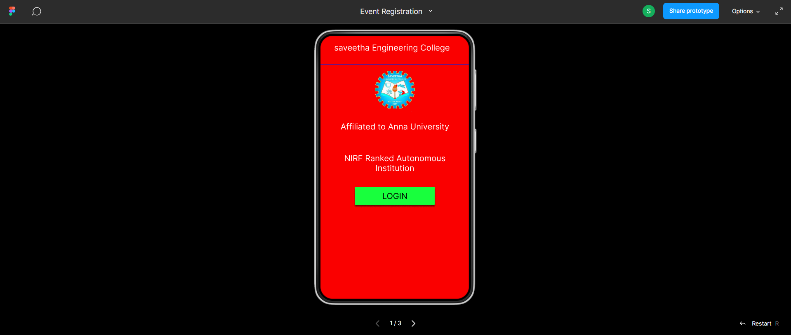
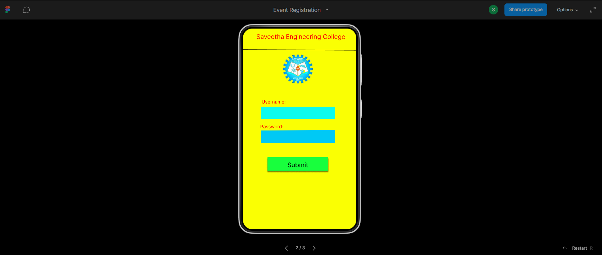
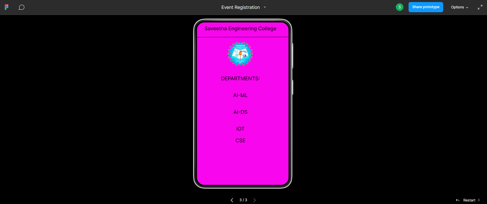

# Event Registration Web Application

## AIM:
To design, develop and deploy a web application for event registration.

## DESIGN STEPS:

### Step 1:
Choose a color palette and idea for the webpage with your team members.


### Step 2:
Open Figma and create a new project file and share the invite to your team members.


### Step 3:
 Start making the UI design for web page.

### Step 4:
 After completing the design export it to PDF.

### step 5:

Validate the HTML and CSS code.

### Step 6:

Publish the website in the given URL.

## DESIGN:

## PROGRAM :
```
/* homepage */


position: relative;
width: 360px;
height: 640px;

background: #FA0000;
box-shadow: 0px 4px 4px rgba(0, 0, 0, 0.25);


/* Login page */


position: relative;
width: 367px;
height: 640px;

background: #FAFF03;
box-shadow: 0px 4px 4px rgba(0, 0, 0, 0.25);


/* Saveetha Engineering College */


position: absolute;
width: 318px;
height: 46px;
left: 12px;
top: 12px;

font-family: 'Inter';
font-style: normal;
font-weight: 400;
font-size: 20px;
line-height: 24px;
text-align: center;

color: #000000;


/* DEPARTMENTS: */


position: absolute;
width: 318px;
height: 46px;
left: 12px;
top: 209px;

font-family: 'Inter';
font-style: normal;
font-weight: 400;
font-size: 20px;
line-height: 24px;
text-align: center;

color: #000000;


/* AI-ML */


position: absolute;
width: 318px;
height: 46px;
left: 12px;
top: 275px;

font-family: 'Inter';
font-style: normal;
font-weight: 400;
font-size: 20px;
line-height: 24px;
text-align: center;

color: #000000;


/* AI-DS */


position: absolute;
width: 318px;
height: 46px;
left: 12px;
top: 341px;

font-family: 'Inter';
font-style: normal;
font-weight: 400;
font-size: 20px;
line-height: 24px;
text-align: center;

color: #000000;


/* IOT */


position: absolute;
width: 318px;
height: 46px;
left: 12px;
top: 407px;

font-family: 'Inter';
font-style: normal;
font-weight: 400;
font-size: 20px;
line-height: 24px;
text-align: center;

color: #000000;


/* CSE */


position: absolute;
width: 318px;
height: 46px;
left: 12px;
top: 453px;

font-family: 'Inter';
font-style: normal;
font-weight: 400;
font-size: 20px;
line-height: 24px;
text-align: center;

color: #000000;


/* Line 3 */


position: absolute;
width: 360px;
height: 0px;
left: 0px;
top: 59px;

border: 1px solid #000000;
transform: rotate(-0.16deg);


/* sec-preview (1) 4 */


position: absolute;
width: 97px;
height: 92px;
left: 122px;
top: 78px;

background: url(seclogo.png);
```

## OUTPUT:





## Result:
 The program to design, develop and deploy a web application for event registration is completed successfully.
